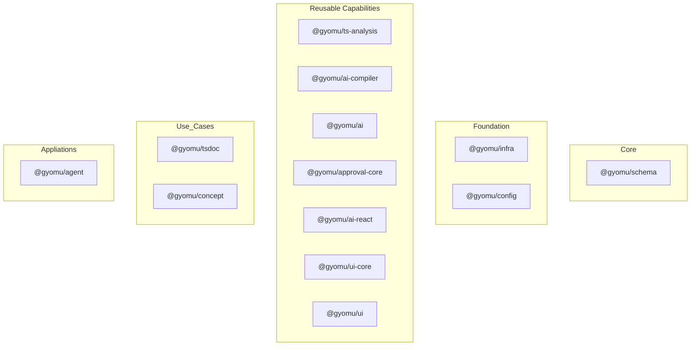
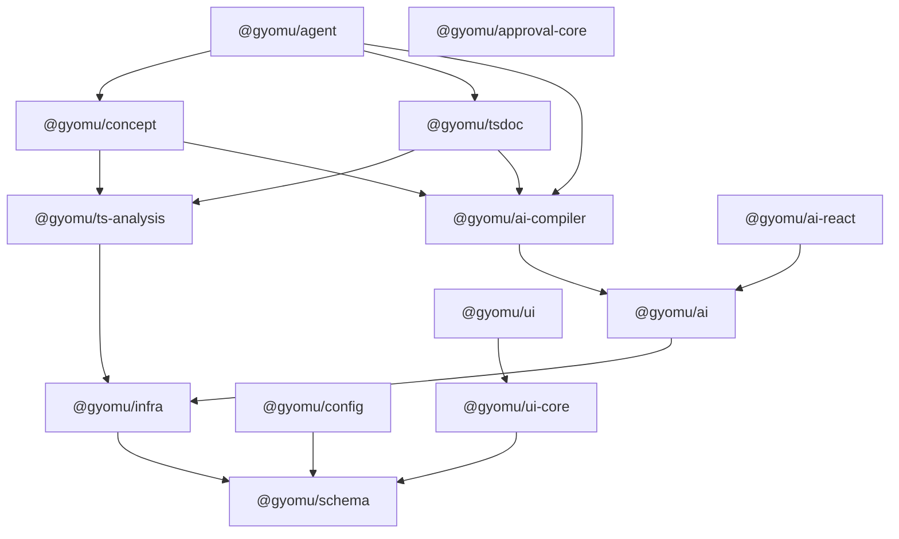
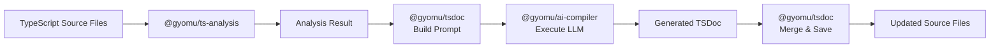
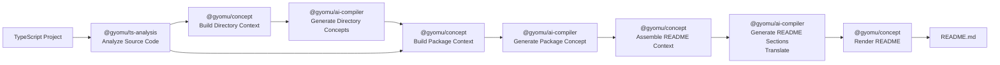

[US English](Architecture.md) | JP 日本語

# 1. Philosophy

- ## Why Gyomu Exists
  - エンタープライズ開発を効率化するために始まった
  - File/DB/Securityなど、同じものを何度も実装するのを避け、ビジネスロジックだけを書ける状態を目指す

- ## AI Changed Everything
  - AIによって開発プロセスが変わった
  - 保守コストが新しいボトルネックになった

- ## Open Knowledge over Closed Feedback
  - 開発者一人ひとりのフィードバックをAI企業だけでなくOSSにも蓄積したい
  - AI開発の知見をOSSとして蓄積したい
  - フィードバックループをコミュニティ資産にしたい

- ## Why Effect
  - Effectは難しい。しかしAI時代にはこのくらいの型安全性と抽象化が必要だと考えている。

  - AI時代の複雑性を扱うための基盤
    - 強力な型制御がAI開発の効率化に寄与する

- ## Who We're Looking For
  - Effectを楽しめる人
  - AI開発を本気でやっている人
  - OSSとして知見を積み重ねたい人

# 2. Package Architecture

## Package Layers

## Package Dependency

簡易的な図

## Packages

### @gyomu/schema

Gyomuプロジェクト全体の中核となるパッケージです。Effect Schemaを用いて、データ構造・設定・永続化モデル・AI Structured Output・エラー定義などを統一的に表現します。
その他純粋関数など提供しています。

すべてのパッケージは `@gyomu/schema` を共通言語として利用し、型安全性と一貫したデータモデルを維持します。

---

### @gyomu/infra

ファイルシステム・Zip/Gzip・FTP/SFTP・HTTP・データベース・ログなど、外部システムとのI/Oを提供するインフラストラクチャ層です。
ほかに暗号化・ハッシュなども提供します。

ビジネスロジックは基本的に持たず、Effect Layerを利用したサービスとして各種機能を提供します。

---

### @gyomu/config

Gyomu全体の設定管理を担当します。

設定ファイルの読み込みや検証を行い、型安全なConfigurationをEffect Layer経由で各パッケージへ提供します。

---

### @gyomu/ai

LLMを利用するための基盤ライブラリです。

モデルルーティング、Structured Output、Retry、Streaming、Embeddingなど、AIプロバイダーごとの差異を吸収し、統一されたインターフェースを提供します。

---

### @gyomu/ai-compiler

LLMを利用した処理を共通化するためのAI実行基盤です。

ユースケース固有の知識は持たず、「プロンプト + Schemaから型安全な結果を取得する」という責務に特化しています。README生成やConcept生成などの各ユースケースは、本パッケージを利用してLLMを実行します。

---

### @gyomu/ts-analysis

TypeScriptソースコードを解析するための基盤ライブラリです。

ts-morphを利用し、公開API、依存関係、シンボル情報、ディレクトリ構造などを解析し、上位パッケージへコード分析能力を提供します。

---

### @gyomu/tsdoc

TypeScriptコードからTSDocの生成・更新を支援します。

ソースコード解析とAIを組み合わせ、コメント生成やSnapshotを利用した安全な更新を実現します。

---

### @gyomu/concept

プロジェクトやパッケージのConcept、README、Architectureなどのドキュメント生成を担当します。

コード解析とAIを組み合わせ、ソフトウェアの構造や設計思想を継続的にドキュメントへ反映します。

`Gyomu`では*concept*をプロジェクトのアーキテクチャ、責任範囲、設計意図をソースコードから作成したり、人が書いたりしたものをプロジェクトモデルとして維持管理する構造型の表現を指します。

---

### @gyomu/approval-core

成果物をレビュー・承認するための共通基盤です。

Human-in-the-Loopを前提とし、承認フローやレビュー結果を統一的に扱える仕組みを提供することを目指しています。(AIプロセスに限らない)

---

### @gyomu/ui-core

UIフレームワークに依存しないUI基盤ライブラリです。

AutoForm、Validation、フォームモデルなど、再利用可能なUIロジックを提供します。

---

### @gyomu/ui

MUIやshadcn/uiを利用したGyomu標準コンポーネントライブラリです。

`@gyomu/ui-core` の機能を利用し、実際の画面開発で利用するコンポーネント群を提供します。

---

### @gyomu/ai-react

Reactアプリケーション向けのAI UI統合ライブラリです。

Gyomu AIプロトコルとReact UIの橋渡しを行い、チャット状態管理、ストリーミング表示、メッセージ変換などを標準化します。

---

### @gyomu/agent

Gyomuの最上位レイヤーとなるアプリケーション実行基盤です。

複数のCapabilitiesやSolutionを組み合わせ、コード解析、AI実行、承認、ドキュメント生成などを一連のワークフローとして実行するAgentの実装を提供します。(_ほぼ未実装_)

# 3. Dependency Rules

Gyomuでは、各パッケージの責務を明確に保ち、長期的に保守しやすい構造を実現するため、レイヤードアーキテクチャを採用しています。

## すべてのパッケージに適用されるルール

- 依存関係は、必ず上位レイヤーから下位レイヤーへ向けること。
- 下位レイヤーは、上位レイヤーへ依存してはならない。
- 同一レイヤー内のパッケージ同士は、可能な限り独立性を維持すること。
- レイヤーをまたぐ連携は、明確に定義されたインターフェースおよび Effect Service を介して行うこと。
- 共通で利用されるデータ構造、設定、エラー定義は重複して定義せず、`@gyomu/schema` に集約すること。

この依存モデルにより、各パッケージは単一の責務に集中しつつ、上位レイヤーは下位レイヤーが提供する機能（Capabilities）を組み合わせて、より高度な機能を構築できます。

また、上位レイヤーでは既存のCapabilitiesを組み合わせることを基本とし、同じ機能を再実装してはなりません。

例えば、`@gyomu/concept` はLLMとの通信処理を直接実装するのではなく、TypeScript解析とAI実行機能を組み合わせることでREADMEやConcept生成を実現しています。

## Examples:

### Good

✔ `@gyomu/concept` → `@gyomu/ai-compiler`

✔ `@gyomu/tsdoc` → `@gyomu/ts-analysis`

### Bad

✘ `@gyomu/schema` → `@gyomu/infra`

✘ `@gyomu/infra` → `@gyomu/concept`

# 4. Effect Design Principles

## Layer

以下の場合にLayer化します

- 一定の機能群を提供し、それが他からよく使うと考える場合
  - 例：`BusinessCalendarService`（営業日チェック）、`FileSearchService`（ファイル検索）
- DIを通じて別機能を提供したい場合
  - 例：`AiModelRoute` （どの機能の時にどのようなAIプロバイダにして、バックアップ時どうするか、など）

## Effect Schema

Effect Schemaは以下の用途で利用

- データのValidation
- UI等での入力チェック
- LLM Structured Output等に使うJSON Schema
- DBオブジェクト、ビジネスロジック用オブジェクト、UIオブジェクト間の変換

例：Package Conceptを作成し、それをファイルに保存し、後からそれを読み込んでオブジェクトにする場合、`JSON.parse`だけではそれが「今」のInterfaceに合っているかわからないため、Effect Schemaを使ってValidationを行う

## Error

- ErrorはEffectのTaggedErrorを使い、識別はIDを使って行っている。
- エラーの中身は必ずデータ構造化し、エラー種別ごとに定義している。

IO処理中は`IOError`を出すようにし、それがTypescript分析に入ると、`IOError`を内包して、`AnalysisError`にするなどしている

# 5. Typical Execution Flow

## TSDoc生成

TSDoc生成ワークフローは、複数のGyomuパッケージがどのように連携して動作するかを示す代表的な例です。

`@gyomu/ts-analysis` はTypeScriptソースコードから構造情報を抽出します。
`@gyomu/tsdoc` はその情報をAIが理解しやすいコンテキストへ変換し、ドキュメント生成を `@gyomu/ai-compiler`に委譲します。生成された結果は、検証された後に元のソースコードへマージされます。

**Notes**

- `@gyomu/ai-compiler` の責務はAIの実行のみです。プロンプトの構築やワークフロー全体の制御は上位パッケージが担当します。
- I/Oを伴う処理を行うパッケージは、`@gyomu/infra`に依存します。
- 共通のインターフェース、Schema、エラー定義は重複を避けるため、`@gyomu/schema` に集約します。

## README / Concept 生成

README生成ワークフローは、単一のLLMリクエストではなく、複数段階にわたって知識を構築するプロセスとして設計されています。

- `@gyomu/ts-analysis` がTypeScriptプロジェクトを解析し、構造情報を抽出します。
- `@gyomu/concept` はその情報をもとに、ディレクトリコンセプト、パッケージコンセプト、そして最終的なドキュメントモデルへと段階的に再構築します。
- 各段階において、`@gyomu/ai-compiler` はAIの実行のみを担当し、ワークフロー全体の制御は `@gyomu/concept`が行います。
- 最後に、構築されたドキュメントモデルをもとにREADMEおよび各言語向けの翻訳を生成します。

**Notes**

- `@gyomu/ai-compiler` の責務はAIの実行のみです。プロンプトの構築やワークフロー全体の制御は上位パッケージが担当します。
- 知識は単一のLLMリクエストで生成するのではなく、「ディレクトリ → パッケージ → README」という段階的なプロセスで構築されます。
- I/Oを伴う処理を行うパッケージは、`@gyomu/infra`に依存します。
- 共通のインターフェース、Schema、エラー定義は重複を避けるため、`@gyomu/schema` に集約します。

# 6. Design Principles

- Schema First
  - すべてはSchemaの定義から始まります。
- Functional Core
  - ビジネスロジックは可能な限り純粋関数として実装します。
- 副作用はEffectで管理
  - ファイルI/OやHTTP通信などの副作用はEffectを通じて管理します。
- Dependency InjectionはLayerで実現
  - 依存関係はEffect Layerを通じて注入します。
- AIをサービスとして設計
  - AIの実行はビジネスロジックから分離し、独立したサービスとして扱います。
- すべてを型安全に扱う
  - あらゆる境界でデータを検証し、型安全性を維持します。
- パッケージごとの責務を明確に分離する
  - すべてのパッケージは単一の責務を持つよう設計します。

## Non Goals

Gyomuでは、以下のような設計は意図的に採用しません。

- Effectの抽象化を隠蔽する
  - Effectを過度に抽象化すると、Effectが持つ表現力や型安全性を活かせず、AI開発における柔軟性や保守性を損なうと考えています。
- フレームワーク固有のビジネスロジックを提供する
  - 特定のフレームワークに依存したビジネスロジックは提供しません。
- 既存のAI SDKを置き換える
  - AI SDKを独自実装で置き換えることは目的ではなく、その上位で利用できる共通基盤を提供することを目指します。
- 単一のLLMプロンプトですべてを生成する
  -解析・知識構築・生成を段階的に行い、保守性・再利用性・生成品質を重視します。
