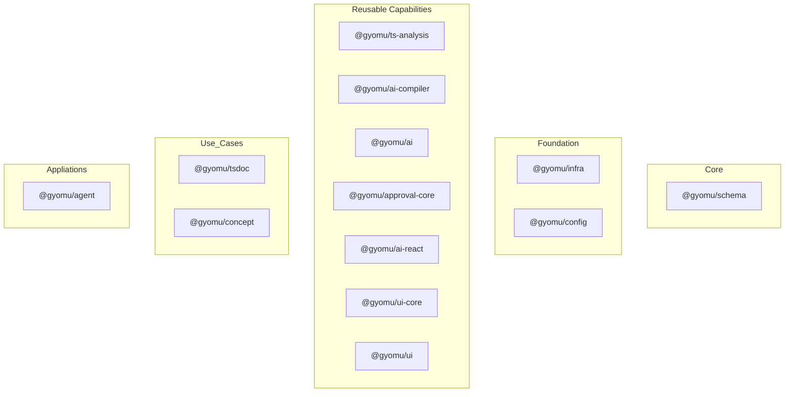
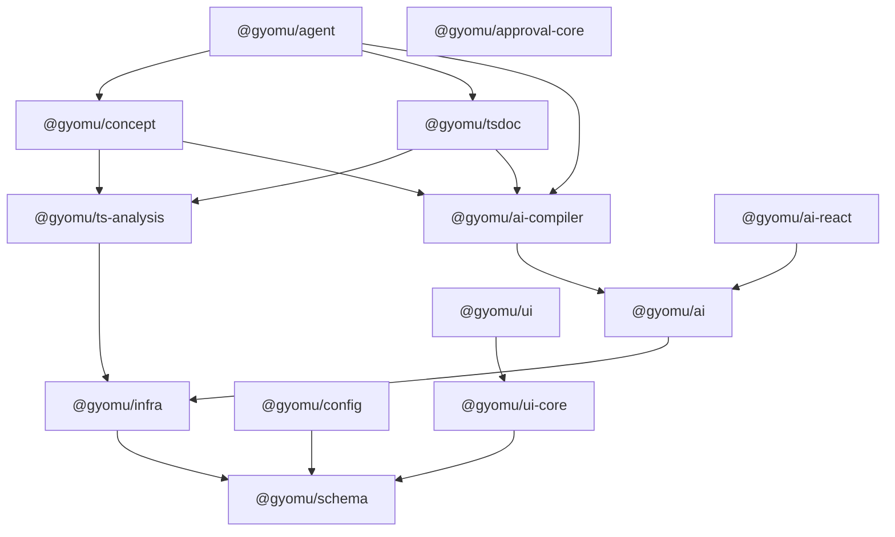
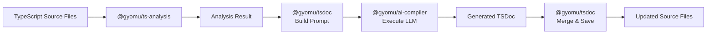
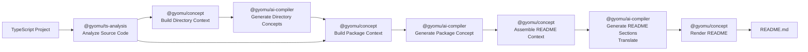

US English | [JP 日本語](Architecture.ja.md)

# 1. Philosophy

- ## Why Gyomu Exists
  - Gyomu was originally created to accelerate enterprise application development.
  - Our goal is to eliminate repetitive implementations of common infrastructure such as file operations, databases, and security, allowing developers to focus on business logic.

- ## AI Changed Everything
  - AI has fundamentally changed the software development process.
  - As AI accelerates implementation, maintaining code, documentation, and tests has become the new bottleneck.

- ## Open Knowledge over Closed Feedback
  - We believe that developer feedback should become part of the open-source ecosystem, not only the assets of AI providers.
  - We want to accumulate practical knowledge about AI-assisted development as an open community resource.
  - Our goal is to turn feedback loops into shared knowledge that benefits everyone.

- ## Why Effect
  - Effect has a steep learning curve. However, we believe its level of type safety and abstraction is exactly what modern AI-driven software development requires.

  - Effect provides a solid foundation for managing the complexity introduced by AI.
    - Strong type systems significantly improve the reliability and maintainability of AI-powered applications.

- ## Who We're Looking For
  - Developers who enjoy working with Effect.
  - Engineers who are serious about AI-assisted software development.
  - People who want to build and share knowledge through open source.

# 2. Package Architecture

## Package Layers

## Package Dependency

Simple Diagram

## Packages

### @gyomu/schema

The core package of the entire Gyomu project. It uses Effect Schema to provide a unified representation of data structures, configuration, persistence models, AI Structured Output schemas, and error definitions. It also provides common pure utility functions.

All packages use `@gyomu/schema` as a shared language to ensure type safety and a consistent data model across the project.

---

### @gyomu/infra

The infrastructure layer that provides I/O capabilities for external systems, including file systems, Zip/Gzip, FTP/SFTP, HTTP, databases, and logging. It also provides common utilities such as encryption and hashing.

This package contains little to no business logic. Instead, it exposes reusable services through Effect Layers.

---

### @gyomu/config

Responsible for configuration management across the Gyomu ecosystem.

It loads and validates configuration files, then provides type-safe configuration objects to other packages through Effect Layers.

---

### @gyomu/ai

The foundation library for interacting with Large Language Models (LLMs).

It provides a unified interface over different AI providers by handling model routing, Structured Output, retry strategies, streaming, embeddings, and other provider-specific features.

---

### @gyomu/ai-compiler

The shared AI execution layer for LLM-powered functionality.

It contains no use-case-specific knowledge. Its sole responsibility is to execute prompts and return type-safe results validated against Effect Schemas. Higher-level packages such as README generation and Concept generation delegate AI execution to this package.

---

### @gyomu/ts-analysis

The foundation library for analyzing TypeScript source code.

Built on top of ts-morph, it analyzes public APIs, dependencies, symbol information, and directory structures, providing reusable code analysis capabilities to higher-level packages.

---

### @gyomu/tsdoc

Provides automatic generation and maintenance of TSDoc comments for TypeScript projects.

It combines TypeScript analysis with AI to generate documentation and safely update existing source code using snapshot-based merging.

---

### @gyomu/concept

Responsible for generating project and package documentation such as Concepts, README files, and Architecture documents.

By combining source code analysis with AI, it continuously reflects the software structure and design philosophy in project documentation.

In Gyomu, a "Concept" refers to a structured description of a project's architecture, responsibilities, and design intent, generated from source code and maintained as project knowledge.

---

### @gyomu/approval-core

A shared foundation for reviewing and approving generated artifacts.

Designed around a Human-in-the-Loop workflow, it aims to provide a unified mechanism for approval processes and review results. Its scope is not limited to AI-generated content.

---

### @gyomu/ui-core

A UI foundation library independent of any specific UI framework.

It provides reusable UI logic such as AutoForm, validation, and form models.

---

### @gyomu/ui

Gyomu's standard component library built on top of MUI and shadcn/ui.

It leverages the capabilities of `@gyomu/ui-core` and provides reusable UI components for application development.

---

### @gyomu/ai-react

A React integration library for AI-powered user interfaces.

It bridges the Gyomu AI protocol and React applications by standardizing chat state management, streaming UI, and message transformation.

---

### @gyomu/agent

The top-level application layer of the Gyomu ecosystem.

It orchestrates multiple capabilities and solutions—including code analysis, AI execution, approval workflows, and documentation generation—to provide end-to-end development automation. (_Currently in the early stages of implementation._)

# 3. Dependency Rules

Gyomu adopts a layered architecture to keep package responsibilities clear and maintainable.

## The following rules apply to all packages:

- Dependencies must always point from higher layers to lower layers.
- Lower layers must never depend on higher layers.
- Packages within the same layer should remain independent whenever possible.
- Cross-layer communication should occur through well-defined interfaces and Effect services.
- Shared data structures, configuration, and error definitions should be placed in `@gyomu/schema` instead of being duplicated.

This dependency model keeps each package focused on a single responsibility while allowing higher-level packages to compose lower-level capabilities.

Higher-level packages should compose existing capabilities instead of reimplementing them.

For example, `@gyomu/concept` combines TypeScript analysis and AI execution rather than directly implementing LLM communication.

## Examples:

### Good

✔ `@gyomu/concept` → `@gyomu/ai-compiler`

✔ `@gyomu/tsdoc` → `@gyomu/ts-analysis`

### Bad

✘ `@gyomu/schema` → `@gyomu/infra`

✘ `@gyomu/infra` → `@gyomu/concept`

# 4. Effect Design Principles

## Layer

In Gyomu, a service is implemented as an Effect Layer in the following situations:

- When it provides a reusable set of capabilities that are expected to be shared across multiple packages.
  - Examples: `BusinessCalendarService` (business day calculation), `FileSearchService` (file searching)
- When functionality should be provided through dependency injection (DI).
  - Example: `AiModelRoute`, which determines which AI provider to use for a specific use case, including fallback strategies.

## Effect Schema

Effect Schema is used throughout Gyomu for the following purposes:

- Data validation
- Input validation for user interfaces
- Generating JSON Schemas for LLM Structured Output
- Transforming data between database models, business objects, and UI models

For example, when a Package Concept is generated, saved to a file, and later loaded again, `JSON.parse()` alone cannot guarantee that the data still matches the current interface definition. Effect Schema is therefore used to validate the data and safely decode it into the expected object.

## Error

Gyomu adopts Effect's TaggedError as the standard error model.

- Every error is represented by a unique error ID.
- Every error has a well-defined structured payload instead of an untyped message.
- Each error type is defined explicitly as its own schema.

Errors are also wrapped as they propagate through higher layers. For example, an `IOError` raised by the infrastructure layer is wrapped by an `AnalysisError` when it occurs during TypeScript analysis, preserving both the high-level context and the original cause.

# 5. Typical Execution Flow

## TSDOC Generation

The TSDoc generation workflow demonstrates how multiple Gyomu packages collaborate.

`@gyomu/ts-analysis` extracts structural information from the TypeScript source code. `@gyomu/tsdoc` transforms this information into an AI-friendly context and delegates the documentation generation to `@gyomu/ai-compiler`. Finally, the generated result is validated and merged back into the original source file.

**Notes**

- `@gyomu/ai-compiler` is responsible only for AI execution. Prompt construction and workflow orchestration are handled by higher-level packages.
- Packages performing I/O operations depend on `@gyomu/infra`.
- Shared interfaces, schemas, and error definitions are defined in `@gyomu/schema` to avoid duplication across packages.

## README / Concept Generation

The README generation workflow is built as a multi-stage knowledge construction process rather than a single LLM request.

- `@gyomu/ts-analysis` first analyzes the TypeScript project and extracts structural information.
- `@gyomu/concept` progressively reconstructs this information into directory concepts, package concepts, and finally a documentation model.
- At each stage, `@gyomu/ai-compiler` performs only the AI execution, while the surrounding orchestration remains within `@gyomu/concept`.
- The final README and its translations are then rendered from the generated documentation model.

**Notes**

- `@gyomu/ai-compiler` is responsible only for AI execution. Prompt construction and workflow orchestration are handled by higher-level packages.
- Shared knowledge is constructed incrementally (Directory → Package → README) instead of being generated in a single LLM request.
- Packages performing I/O operations depend on `@gyomu/infra`.
- Shared interfaces, schemas, and error definitions are defined in `@gyomu/schema` to avoid duplication across packages.

# 6. Design Principles

- Schema First
  - Everything starts from a schema.
- Functional Core
  - Business logic should remain pure.
- Effect for Side Effects
  - Side effects such as file I/O and HTTP communication should be managed through Effect.
- Layer for Dependency Injection
  - Dependencies should be injected through Effect Layers.
- AI as a Service
  - AI execution is isolated from business logic.
- Everything is Type Safe
  - Every boundary should be validated.
- Package Responsibilities are Explicit
  - Every package has a single responsibility.

## Non Goals

Gyomu intentionally does not:

- Hide Effect abstractions
  - Over-abstracting Effect reduces its expressive power and type safety, ultimately harming the flexibility and maintainability required for AI-driven development.
- Provide framework-specific business logic
  - Gyomu does not provide business logic tied to any specific framework.
- Replace existing AI SDKs
  - Gyomu is not intended to replace existing AI SDKs. Instead, it provides a shared foundation that builds on top of them.
- Generate everything with a single LLM prompt
  - Instead of relying on a single prompt, Gyomu performs analysis, knowledge construction, and content generation as separate stages to maximize maintainability, reusability, and output quality.
