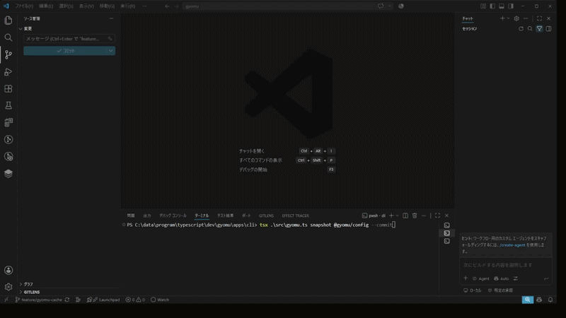
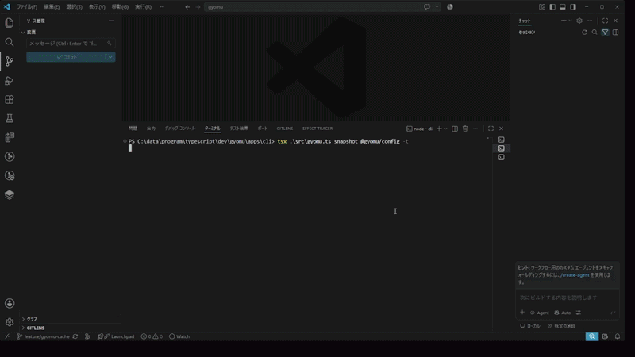

# Gyomu

[US English](README.md) | JP 日本語

> **ドキュメントとテストの「手動メンテナンス」を、もうやめよう。**  
> **Effect TypeScriptで組む、ナレッジを自前で育てるオープンなAIコーディングハーネス。**

[](https://effect.website)
[](LICENSE)

**Gyomu** は、**TSDocの生成、ディレクトリ/パッケージ単位の設計コンセプト抽出、多言語READMEの構築、そしてテストコードの同期・補正**を全自動化・維持するリポジトリ完結型のオープンAIエージェントシステムです。

AIプロバイダーのブラックボックスなプラットフォームに試行錯誤のプロセスを閉じ込めるのではなく、人間が読める形式（YAML / TSDoc / テスト）として**リポジトリ側にナレッジとフィードバック資産を蓄積**します。

---

## ⚡ デモ

### 1. 多言語READMEの自動生成

シンプルなYAML設定とディレクトリ構造から、設計コンセプトを反映した多言語READMEを自動生成・最新維持します。



### 2. TSDoc & コンテキストの自動抽出・維持

コードの変更を検知し、正確なTSDocコメントやパッケージレベルの設計ドキュメントをリアルタイムで追従・補正します。



---

## 💡 なぜこのプロジェクトなのか？

### 1. 「ドキュメントとテストのメンテ地獄」からの解放

AIコーディングの品質を極めるには、最新のTSDoc、設計背景、充実したテストコードが不可欠です。しかし、これらを常にメンテナンスし続けるのはエンジニアにとって最も泥臭く、時間を奪われる作業です。
ドキュメントやテストの追従・補正をエージェントに任せることで、**人間は本質的で創造的なコーディングに100%集中**できるようになります。

### 2. 特定プラットフォームに縛られない「オープン・ハーネス」

既存の大手AIプロバイダーは、エージェントの実行・検証ループ（ハーネス）を自社プラットフォーム内に閉じ込める傾向があります。
本システムは、コンテキストや検証の正解（Single Source of Truth）をリポジトリ内のコード・YAML・テストとして保持。モデルやプロバイダーの変更に左右されない**アンチ・ベンダーロックイン**を実現します。

### 3. Effect (TypeScript) による型安全で堅牢な設計

複雑なLLMストリーミング、リトライ・フォールバック制御、並列パース、型安全なスキーマ検証を美しく構築するため、コアロジックには全面的に **Effect-ts (v3/v4)** を採用しています。

---

## 🛠 技術スタック

- **言語:** TypeScript (ESM)
- **コアエンジン:** [Effect](https://effect.website/) (`Effect`, `Schema`, `Stream`, `Layer`, `Context`)
- **設定フォーマット:** 人間が書きやすい YAML + TSDoc + ディレクトリ構造

---

## 🤝 開発パートナー / コントリビューター募集！

「AIエージェントのナレッジの主権を自分たちの手元に取り戻したい」「Effect-tsで最高に堅牢なエージェント基盤を組み上げたい」というハイレベルなエンジニアの仲間を募集しています。

- 💡 **Effect-ts ユーザー:** Effectのパイプラインを活用した堅牢なエージェントループの設計・実装
- 🧪 **テスト＆コンテキスト追従の自動化:** エージェントによるテストコードの自動生成・修正ロジックの構築
- 🌐 **プロンプト＆i18n設計:** 多言語生成プロンプトやYAMLスキーマの最適化

### 参加方法

- まずは [GitHub Discussions](https://github.com/Yoshihisa-Matsumoto/Gyomu_Typescript/discussions) で気軽にアイデアを共有してください。
- 手を動かしてみたい方は [`Good First Issues`](https://github.com/Yoshihisa-Matsumoto/Gyomu_Typescript/issues?q=is%3Aissue+is%3Aopen+label%3A%22good+first+issue%22) をチェックしてみてください！

---

## 📖 クイックスタート

```bash
# リポジトリのクローン
git clone https://github.com/Yoshihisa-Matsumoto/Gyomu_Typescript.git

# 依存関係のインストール
pnpm install

# ビルド実行
pnpm build
```
