# Effect / Stream 理解整理

## 0. 全体像（設計思想）

- Effectのオブジェクト自体は、実際中の作業は実行しない。処理の設計図である。
- EffectがPull型、ということは設計図であるEffect上の後工程が前工程に要求する、というイメージ

```
source → map → filter → runForEach
```

しかし実行時の制御は

```
runForEach
↑
filter
↑
map
↑
source
```

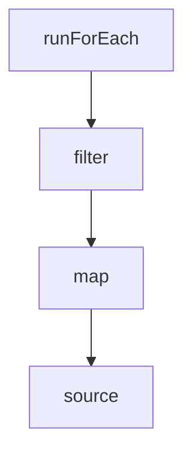

runForEachするから次お願い → filter → map → source というPull型の流れ

---

## 1. 実行単位（Fiber）

- Fiberは超軽量スレッド（OSスレッドではない）
- 並列処理、キャンセル、Join、構造的終了が可能

状態：

- Running（実行中）
- Suspended（非同期待ち）
- Done（成功・失敗・例外）
- Interrupted（キャンセル）

- Effectが完了するまでDoneにならない
- 自分から処理を手放すまで実行される
- yieldする = 実行を一旦手放す

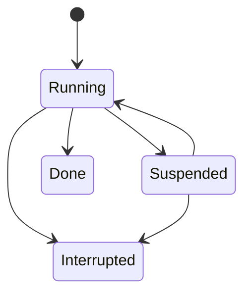

---

## 2. Effect（基本）

### 2.1 Effectとは

- Effectは処理の設計図
- 実行は以下で行う
  - yield\*
  - Effect.runFork / runChild など

---

### 2.2 Effectの生成

- Effect.promise  
  → Promiseを実行するEffectを「生成する」（実行はしない）

- Effect.sync  
  → 同期処理をEffect化  
  → 例外を投げてはいけない（catchされない）

---

### 2.3 Effectの変換

- Effect.map  
  → 値を変換

- Effect.flatMap  
  → Effectを返す処理を合成（ネストを潰す）

```
Effect.map → Effect<Effect<A>>
Effect.flatMap → Effect<A>
```

---

### 2.4 副作用

- Effect.tap  
  → 値を変えずに副作用を追加

- tap内ではEffect.syncをよく使う（必須ではない）

---

### 2.5 Effect.gen

- Effect.gen(function\* () {})  
  → Effectを型安全に逐次処理として書く構文

- yield\* の役割  
  → await + DI + エラーハンドリング + 中断管理

- yield と yield\* の違い
  - yield → iteratorを返す
  - yield\* → 中身を展開

- ネストしたEffectでもフラットに書ける

---

### 2.6 並行実行（Fiber生成）

- Effect.forkChild  
  → 親Fiberに紐づく（親終了でInterrupt）

- Effect.forkDetach  
  → 完全に独立

- Effect.forkScoped  
  → Scopeに紐づく（Scope終了でInterrupt）

---

### 2.7 フロー

### ライフサイクル

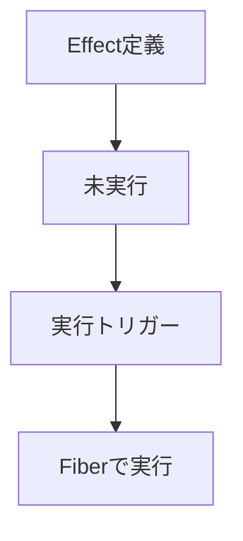

### map vs flatMap

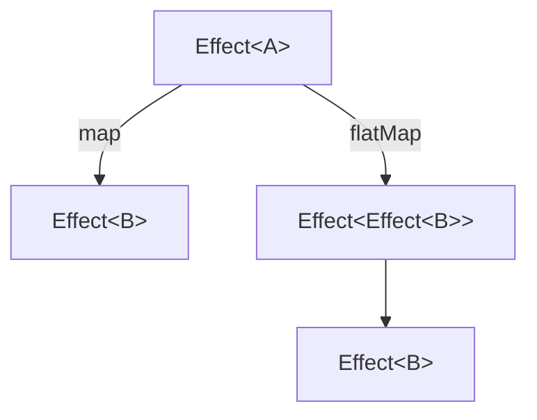

### Effect.gen

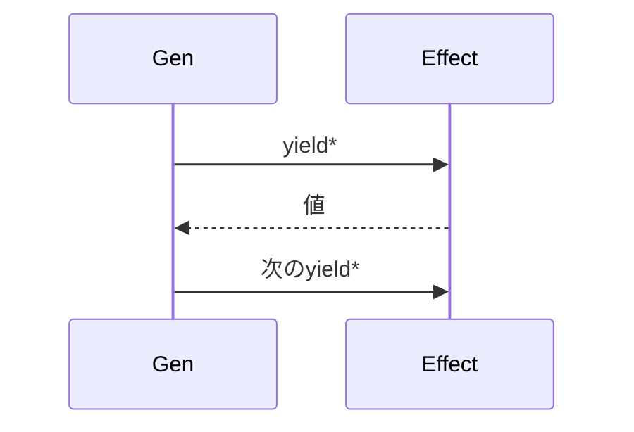

---

## 3. Stream（基本）

### 3.1 Streamとは

- Stream.Stream<>があったとき、pipe内は「処理の定義」であり実行ではない（計画）

---

### 3.2 Stream変換

- Stream.map  
  → 流れてきたデータを変換  
  → 戻りはStream（Stream自体を返す）

---

### 3.3 Effectとの関係

- Stream.unwrap  
  → Effect<Stream> を Stream に展開

---

### 3.4 実行

- Stream.runForEach  
  → 各要素ごとにEffectを実行

- Stream.runForEachChunk  
  → Chunk単位で処理

#### 構造

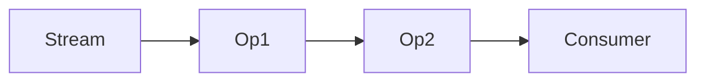

#### 実行（Pull）

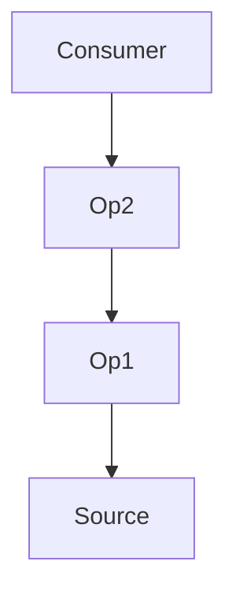

---

## 4. Push / Pull と Queue

### 4.1 Queueの役割

- Push と Pull のバッファ

```
Producer
│
│ offer
▼
Queue
▲
│ take
Consumer
```

---

### 4.2 Pullモデルの実態

- EffectはPull型
- FiberがループしてEffectを実行している

---

## 5. Node Stream連携（重要）

### 5.1 Stream.callback

- Node Stream（Push型）をEffect（Pull型）に変換

---

### 5.2 処理の流れ

1. Node StreamがdataイベントでPush
2. Queue.offerで蓄積
3. Queueは満杯時に待機できるがcallbackは待てない
4. Queue監視してoverflow前にpause
5. 消費されたらresume（Back Pressure）
6. callbackは1回だけ実行（イベント登録）
7. StreamはFiberによってpullされる
8. pullごとにQueue.takeが実行される
9. FiberがEffectを繰り返し実行している

---

### 5.3 全体構造

```
Node Stream
│
▼
Queue.offer
│
▼
Stream.fromQueue
│
▼
Stream.map
│
▼
Stream.runForEach
```

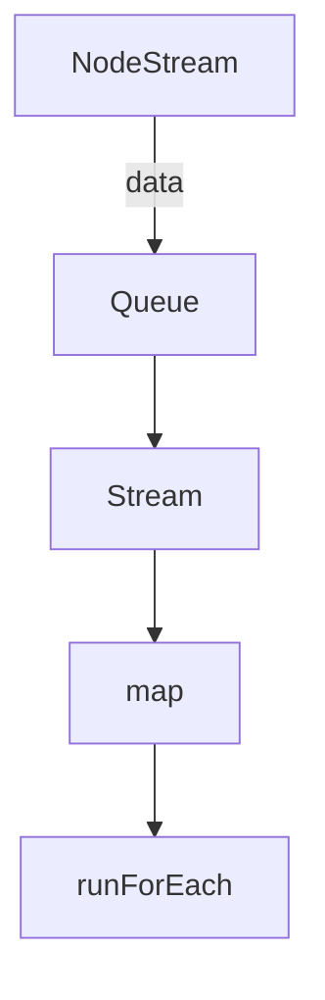

#### BackPressure

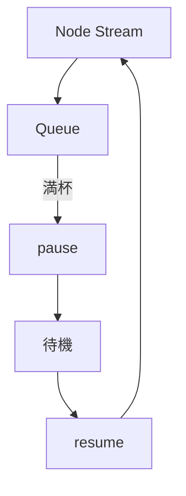

#### Fiber loop

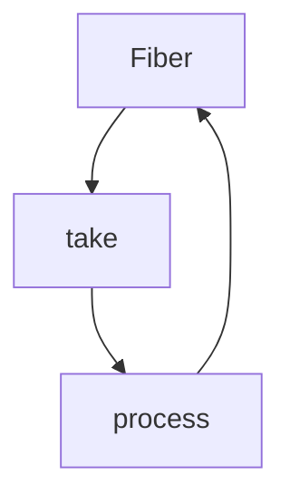

---

## 6. Scope / Layer（リソース管理）

### 6.1 Scope

- C#のusingに近い
- リソース解放を保証

特徴：

- 非同期OK
- 並列OK
- 複数リソース合成可能
- 重複解放も安全

---

### 6.2 Scopeの構造

- Scopeはツリー構造
- 親子関係で管理
- Effect.runごとに生成される

---

### 6.3 Layerとの関係

- 長命リソース（DB・セッションなど）はLayerで管理
- Layer.scopedでアプリ単位管理

---

### 6.4 Stream.scoped

- Scope付きStream
- 終了時に確実にクローズ

---

#### Scopeツリー

ファイルについては、確かにスコープ管理する（Stream.scopedなどで）

DBについても短い処理で完結する場合はそうなのだが、クローズしてしまうと、再度オープンするのに時間・リソースを食うのでクローズは実際にせず、コネクションプールの管理をすることが多い
また、ネット上のシステムへのセッションも似たような感じで、処理が終わったらすぐログアウトするわけではない（別の処理が後で行われるかもしれない）
こうしたものはEffectでLayerとして管理し、その上位のアプリレベルで終了時にクローズなどを行う
Layer.scopedは長命でアプリ単位で管理

Scope同士は親子関係で束ねる（統合する）ことで管理する＝単一のScopeツリーとして管理する
依存関係がないLayerの親はScopeツリーのルートのScopeの子供として、依存関係があればそこで依存関係を構築する

Scopeツリーは、Effect.runPromiseなど実行されるたびに作られる

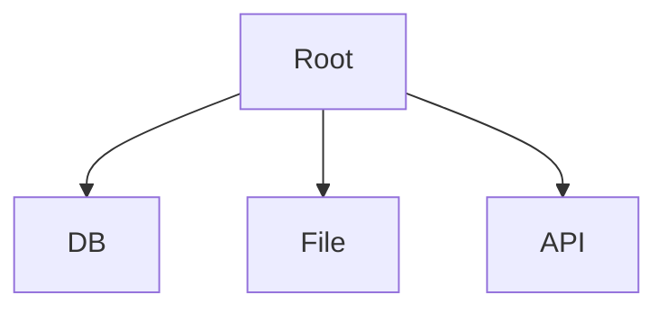

#### ライフサイクル

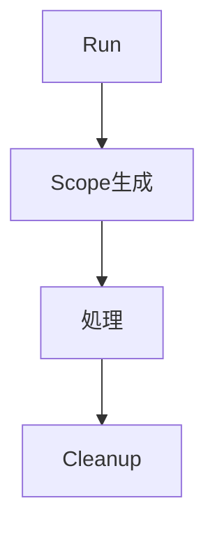

---

## 7. Stream + Fiber + Resourceの注意点

- forkChildだけではNode StreamのPushは止まらない
- 下流停止時は明示的にinterruptが必要
- Stream.ensuringなどでクリーンアップ

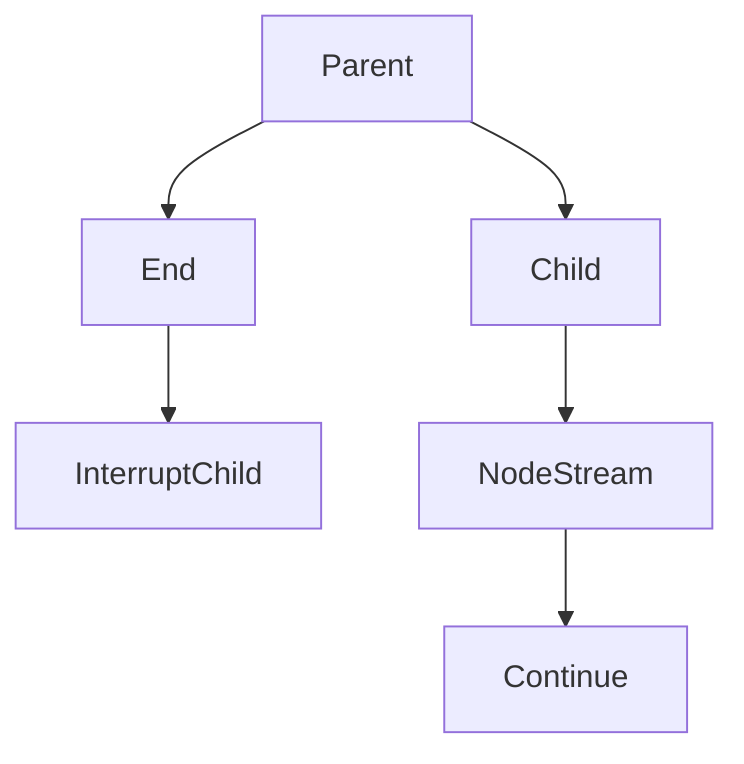

---

## 8. 実践パターン（関数合成）

### 8.1 throughNodeStream の理解

```
export const throughNodeStream =
  <I, O>(duplex: Duplex) =>
  <E, R>(input: Stream.Stream<I, E, R>): Stream.Stream<O, E | IOError, R> =>
    Stream.unwrap(...)
```

---

### 8.2 Function.pipeとの関係

- Function.pipeは単一引数関数を順に適用

```
Function.pipe(
  stream,
  throughNodeStream(...)
)
```

- streamがinputとして渡される

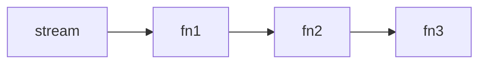

内部：

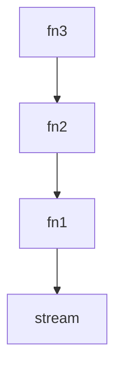

---

### 8.3 ポイント

- EffectはPullで開始される
- 下流が上流に「inputを要求」する
- pipeはその接続を構築している

---

### 8.4 制約

- pipe内関数は単一引数
- 複雑な場合はEffect.genを使う

---

## まとめ（構造）

1. 設計思想（Pullモデル）
2. Fiber（実行単位）
3. Effect（定義・合成・実行）
4. Stream（データフロー）
5. Queue（Push/Pull橋渡し）
6. Node Stream連携（実践）
7. Scope / Layer（リソース管理）
8. 実践パターン（pipe / 高階関数）

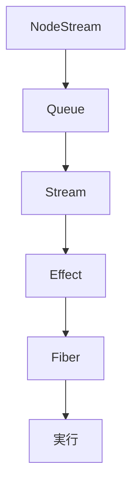
